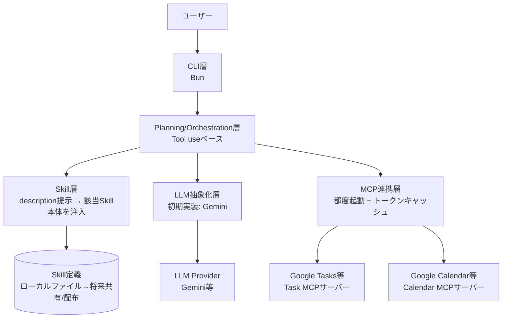

# satellite 設計ドキュメント

## 1. 全体アーキテクチャ

本システムは以下のレイヤーで構成する．



### 1.1 CLI層

- 実装: Bun（ランタイム/パッケージ管理）
- ユーザーからの入力を受け付け，Planning/Orchestration層を呼び出すエントリポイント

### 1.2 Planning/Orchestration層

- ユーザーの入力・状況を解釈し，必要なToolをどう使うか，LLMにどう問い合わせるかを組み立てる中核ロジック
- **方針**: どのToolを呼ぶかはLLM自体のTool use機能に判断させる．独自のルールベースロジックは間に挟まない
- サービス非依存性（特定のTask/Calendarサービスに依存しない設計）の要となるレイヤー

### 1.3 LLM抽象化層

- Provider（Gemini等）ごとの差異を吸収する共通インターフェースを提供
- Planning/Orchestration層からは，Providerを意識せず共通APIで呼び出せるようにする
- 初期実装対象のProviderはGemini

### 1.4 MCP連携層

- Google Tasks / Google Calendar等の外部サービスに，既存の公開MCPサーバー実装（Google Calendar MCP等）を極力再利用してアクセスする
- Task/Calendarという「サービス種別」を抽象化したインターフェースを持つ
- **サーバープロセスの起動方式**: CLI起動時に都度サーバープロセスを立ち上げる（常駐はさせない）
- **認証トークン管理**: OAuth等の認証トークンはローカルにファイルベースでキャッシュし（`~/.config/satellite/` 等を想定），都度起動でも再利用する．OSキーチェーン等のセキュアストレージは使わず，実装コストの低いファイルベース方式を採用

#### 起動方式の検討経緯（都度起動 vs 常駐）

| 観点 | 都度起動 | 常駐 |
|---|---|---|
| 実装の単純さ | シンプル | デーモン化・再起動処理等が必要で複雑 |
| 起動レイテンシ | 毎回初期化オーバーヘッドあり | 初回起動後は即応答 |
| 状態管理 | 基本ステートレス | セッション・キャッシュを保持しやすい |
| リソース消費 | 使わない時は0 | 常時消費 |
| 障害時の挙動 | 再実行で自然にリセット | 明示的な再起動が必要 |

個人利用のCLIツールという想定・MVPフェーズであることから都度起動を採用しつつ，OAuthのUX懸念には認証トークンのローカルキャッシュで対応する，というハイブリッド方針とした．

---

## 2. Skill層

Claude Skillsのような仕組みを導入し，特定の作業手順やドメイン知識をMarkdownファイルとして定義し，状況に応じて動的にLLMのコンテキストへ読み込めるようにする．MCP連携層（外部サービスとの実動作）とは別軸で，「LLMに追加の振る舞い・知識を与える」ためのレイヤーという位置づけ．

- 各Skillは「**description**（トリガー条件）＋ **本体Markdown**（手順・知識）」の組で定義する
- **発見方法**: Skillのdescription一覧を毎回LLMに提示し，該当するかどうかをLLM自身に判断させる（キーワードマッチ等のルールベースは採用しない）
- 該当すると判断されたSkillの本体をコンテキストに注入してから，Tool use（MCP呼び出し）を行わせる
- ③で定義する低レベルインターフェースでは対応しきれない複雑な処理（例:「今週の予定と組み合わせてタスクを提案する」）は，このSkill層側で「Tool群をどう組み合わせて使うか」という手順を持たせる，という役割分担とする
- **置き場所・利用者**: 当初はローカルファイルのみを想定するが，将来的な共有・配布（他ユーザーとのSkill流通）も見据えた設計とする

### 2.1 Skill定義のファイル形式

Claude Skillsに忠実な形式を採用する．メタデータを別ファイルに分離するのではなく，`SKILL.md`という1ファイルの中に，YAMLフロントマター（メタデータ）と本体Markdown（手順・知識）を同居させる．

```markdown
---
name: weekly-task-planning
description: 今週のタスクとスケジュールを組み合わせて計画を提案する際に使用する
---

# 手順

1. ③のTool経由で今週の予定を取得する
2. ...
```

Skillはディレクトリ単位で管理し，`SKILL.md`本体に加えて，参考資料やスクリプトなどの付随リソースを同じディレクトリに同梱できる構造とする（Claude Skillsと同様）．

```
skills/
└── weekly-task-planning/
    ├── SKILL.md
    └── references/       # 付随リソース（任意）
```

### 2.2 コンテキストへの注入方法（実装詳細）

専用Tool（`loadSkill(name)`等）による**遅延読み込み方式**を採用する．①で定めた「Tool useベース」という設計方針との一貫性を優先し，事前判定用の別LLM呼び出しは挟まない．

**流れ**

1. 全Skillのdescription一覧を，常にシステムプロンプトに埋め込んでおく
2. ユーザーの入力に対し，LLMが関連しそうなSkillがあると判断したら，`loadSkill(name)`Toolを呼び出す
3. `loadSkill`は該当Skillの`SKILL.md`本体を読み込み，結果としてLLMに返す（会話コンテキストに追加される）
4. LLMは読み込んだ本体の指示に従い，以降の処理（③のTool呼び出し等）を行う

```typescript
const loadSkillTool = tool({
  description: "指定したSkillの詳細な手順を読み込む",
  parameters: z.object({ name: z.string() }),
  execute: async ({ name }) => skillRegistry.loadBody(name),
});
```

### 2.3 共有・配布

MVPスコープでは，Skillは`skills/`配下のローカルファイルとして置くのみとする．

以下は将来検討事項として書き残す．

- 配布形式（単一ディレクトリのzip配布，パッケージレジストリ経由の配布等）
- バージョニングの扱い
- 他ユーザーが作成したSkillを読み込む際の信頼性・セキュリティの扱い（任意のMarkdown指示をLLMのコンテキストに注入することになるため，プロンプトインジェクション的なリスクへの対策が必要になる見込み）

---

## 3. インターフェース設計

Task/Calendarという「サービス種別」を，共通のTypeScriptインターフェースとして抽象化する．

### 3.1 データモデル

全サービス共通の型を定義し，各サービス固有の実装（Adapter）がこの型との相互変換を担う．

```typescript
interface Task {
  id: string;
  title: string;
  dueDate?: Date;
  completed: boolean;
  // ...
}

interface Event {
  id: string;
  title: string;
  start: Date;
  end: Date;
  // ...
}
```

### 3.2 インターフェースの粒度

LLMにToolとして見せる単位は，**低レベル操作（CRUD + パラメータ付きクエリ）** を基本とする．

```typescript
interface TaskService {
  listTasks(params?: { dueBefore?: Date; dueAfter?: Date; completed?: boolean }): Promise<Task[]>;
  createTask(task: NewTask): Promise<Task>;
  updateTask(id: string, patch: Partial<Task>): Promise<Task>;
  deleteTask(id: string): Promise<void>;
}

interface CalendarService {
  listEvents(params?: { from?: Date; to?: Date }): Promise<Event[]>;
  createEvent(event: NewEvent): Promise<Event>;
  updateEvent(id: string, patch: Partial<Event>): Promise<Event>;
  deleteEvent(id: string): Promise<void>;
}
```

#### 検討経緯（低レベル操作 vs 高レベル操作）

| 観点 | 低レベル操作（CRUD単位） | 高レベル操作（ユースケース単位） |
|---|---|---|
| Tool定義の数・安定性 | 少数・安定．サービス非依存の設計方針に合う | ユースケース増加でTool数が増殖しやすい |
| 日付計算等のロジック | LLM自身に計算させるためミスのリスクあり | コード側で保証されるためミスが起きにくい |
| 複雑な処理（タスク×カレンダーの提案等） | LLMが複数Toolを正しく連鎖させる必要がある | ユースケース単位で完結しやすいが，結局サービス固有寄りの実装になりがち |

低レベル操作を基本インターフェースとし，複雑な処理は②で定義したSkill層側の手順に委ねる，という役割分担を採用する．

---

## 4. MCPサーバー連携

既存の公開MCPサーバー実装（Google Calendar MCP等）を極力再利用し，CLI起動時に都度プロセスを立ち上げる方式を採る．

### 4.1 設定ファイル

MCPサーバーごとの起動コマンド・引数は`.env`ではなく，別途の設定ファイルで管理する．Claude Desktopの`mcp_config.json`と同様の形式を想定する．

```json
{
  "mcpServers": {
    "task": {
      "command": "npx",
      "args": ["-y", "@modelcontextprotocol/server-google-tasks"]
    },
    "calendar": {
      "command": "npx",
      "args": ["-y", "@modelcontextprotocol/server-google-calendar"]
    }
  }
}
```

APIキーやOAuthクライアント情報など，機密性の高い値は引き続き`.env`側で管理し，設定ファイルからは環境変数を参照する形にする想定．

### 4.2 サービス構成

MVPでは，サービス種別（Task/Calendar）ごとに1サービスのみを利用する1対1構成とする．同一種別で複数サービスを同時に扱う要件（例: 複数のCalendarアカウントを横断する等）は，MVPスコープ外とする．

### 4.3 Adapterとの結線

設定ファイルで定義された各MCPサーバーに対し，対応するAdapter（`TaskService`実装 / `CalendarService`実装）を1つずつ紐付ける．Planning/Orchestration層のLLMには，Adapterが公開する正規化されたTool定義のみが見える．

---

## 5. LLM抽象化層

Provider（Gemini等）ごとの差異を吸収する共通インターフェースを設計する．

### 5.1 採用ライブラリ

**Vercel AI SDK** を採用する．

- `generateText`/`streamText`という共通APIで，OpenAI/Anthropic/Google等のProviderを差し替え可能
- `streamText`によりストリーミング表示に標準対応
- `ToolLoopAgent`等によりProvider間で差異のあるTool callingプロトコルを統一的に扱える
- 初期実装対象のProviderはGemini（`@ai-sdk/google`）

参考: [AI SDK公式ドキュメント](https://ai-sdk.dev/docs/introduction) / [Tool Calling](https://ai-sdk.dev/docs/ai-sdk-core/tools-and-tool-calling)

### 5.2 ストリーミング対応

MVPの時点からストリーミング表示に対応する．`streamText`を用い，LLMの応答を逐次CLIに出力する．

### 5.3 MCP ToolとAI SDK Toolの結線方式

AI SDKには`@ai-sdk/mcp`というMCPクライアントが用意されており，MCPサーバーのToolをAI SDKの`tool()`形式へ自動変換できる．しかし，これを採用すると③で定義した`TaskService`/`CalendarService`という共通抽象化層を経由しなくなり，以下の点で当初の設計方針が損なわれる．

- サービスの差し替え容易性が失われる（MCPサーバー固有のTool定義がそのままLLMに渡るため）
- 統一されたTask/Event型が使われなくなる
- 危険な操作の制限やパラメータ調整など，独自の絞り込みができなくなる
- テスト時にモックしづらくなる

このため，**③で定義したAdapter（TaskService/CalendarService実装）を経由して，その関数を手動でAI SDKの`tool()`形式にラップする方式**を採用する．`@ai-sdk/mcp`による自動変換は使わない．

```typescript
const listTasksTool = tool({
  description: "タスク一覧を取得する",
  parameters: z.object({
    dueBefore: z.string().optional(),
    completed: z.boolean().optional(),
  }),
  execute: async (params) => taskService.listTasks(params),
});
```

---

## 6. 状況理解・Planningロジック

ユーザーの入力や状況（タスク・予定の状態）を解釈し，提案を組み立てるロジックの設計．

### 6.1 起動トリガー

ユーザーが明示的に質問・依頼した時にのみ動作する，**受動的な設計**とする．CLI起動時に自動で「今日の状況」を要約して提示するような能動的な挙動は行わない．

### 6.2 状況情報の注入方法

情報の性質に応じて，以下のハイブリッド方針を採る．

- **システムプロンプトへの事前埋め込み**: 現在日時のように「起動時点で一度確定すれば変わらず，かつほぼ常に必要になる」情報は，システムプロンプトに直接埋め込む．これによりLLMが自力で日付計算等を行う際にTool呼び出しの往復を減らせる．

```typescript
const systemPrompt = `
あなたはタスク管理とスケジュール管理を支援するアシスタントです．
現在日時: ${new Date().toISOString()}
`;
```

- **Tool経由での都度取得**: タスク/カレンダーの中身のように「聞かれない限り不要」な情報は，③で定義したTool（`listTasks`/`listEvents`等）をLLMが必要に応じて呼び出す形で取得する．

---

## 7. 設定・環境構築

設定ファイル群の配置と，初回セットアップの体験を定義する．

### 7.1 設定ファイルの配置場所

| ファイル | 配置場所 | 内容 |
|---|---|---|
| `.env` | プロジェクト実行ディレクトリ直下 | APIキー，OAuthクライアント情報等の機密情報 |
| MCPサーバー起動設定 | `~/.config/satellite/` 配下 | 各MCPサーバーの起動コマンド・引数（`mcp_config.json`相当） |
| 認証トークンキャッシュ | `~/.config/satellite/` 配下 | OAuth等の認証トークン |

`.env`のみプロジェクト実行ディレクトリ直下に置き，それ以外のホスト環境に紐づく設定・キャッシュ類は`~/.config/satellite/`にまとめる．

### 7.2 初回セットアップ

対話的なセットアップコマンド（`satellite init`のようなもの）は用意せず，READMEに手順を明記し，ユーザーが手動で設定ファイルを配置する方式とする．MVPフェーズではセットアップ体験の作り込みよりも，コア機能の実装を優先する．

---

## 8. ディレクトリ構成・技術スタック

### 8.1 技術スタック

| 項目 | 選定 |
|---|---|
| ランタイム/パッケージ管理 | Bun |
| 言語 | TypeScript |
| LLM SDK | Vercel AI SDK（初期Provider: Gemini） |
| MCP連携 | 独自Adapter経由（`@ai-sdk/mcp`は不使用） |
| テストフレームワーク | `bun:test`（Bun組み込み） |
| ライセンス | MIT |

### 8.2 パッケージ構成

モノレポ化はせず，**単一パッケージ**で進める．将来Skillの共有・配布機能を作る際も，まずは単一パッケージ内のモジュールとして実装し，必要になった時点で分割を検討する．

### 8.3 ディレクトリ構成（案）

```
satellite/
├── src/
│   ├── cli/            # ①CLI層: エントリポイント，対話ループ
│   ├── planning/        # ①Planning/Orchestration層
│   ├── skills/           # ②Skill層: description一覧の提示，本体読み込み
│   ├── llm/               # ⑤LLM抽象化層: Vercel AI SDKラッパー，Provider設定
│   ├── services/          # ③共通インターフェース: TaskService/CalendarService，Task/Event型
│   ├── adapters/          # ③④Adapter実装（MCPサーバー種別ごと）
│   │   ├── google-tasks/
│   │   └── google-calendar/
│   └── config/             # ⑦設定読み込み: .env，mcp_config.json，トークンキャッシュ
├── *.test.ts               # 各モジュールに隣接させたテストファイル（bun:test）
├── mcp_config.json.example # ④MCPサーバー起動設定のサンプル
├── .env.example
├── README.md
├── design_doc.md
└── package.json
```

各ディレクトリは，これまでの①〜⑦で定義したレイヤーに対応する．テストは`bun:test`の慣例に従い，対象ファイルと同じディレクトリに`*.test.ts`として配置する想定．