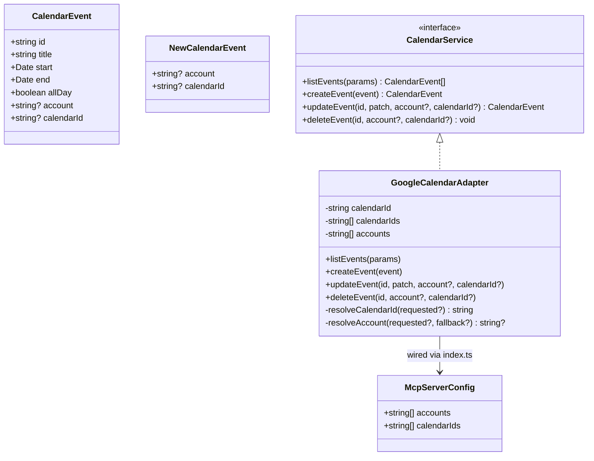

# 実装計画: プライマリ以外のカレンダーの予定取得・作成・更新・削除に対応する

## ドラフトへの指摘

ユーザーの追加方針（読み取りだけでなく作成・更新・削除もプライマリ以外のカレンダーを対象にできるようにする）を採用するにあたり，前回案（読み取り限定）には無かった検討事項を以下に挙げる．技術的には実現可能（`@cocal/google-calendar-mcp` の `create-event` / `update-event` / `delete-event` はいずれも `adapter.ts` で既に `calendarId` 引数を送っており，MCPツール側の対応は確認済み）だが，設計として決めておくべき点がある．

- **Issue本文とのスコープ乖離**：Issue本文は「予定の取得」のみを課題として挙げており，作成・更新・削除への拡張は書かれていない．今回はユーザーの明示的な指示に従いスコープに含めるが，Issue自体には書かれていない機能拡張である旨をタスク一覧・要件に明記し，Issue側にも追記するか確認することを推奨する．
- **createの対象カレンダーの決め方**：`NewCalendarEvent` に `calendarId` を追加し未指定時はアダプタの既定カレンダー（現状の `calendarId` オプション，デフォルト `"primary"`）にフォールバックする設計が必要（前回案には存在しない）．
- **update/deleteが対象カレンダーをどう特定するか**：現状 `CalendarService.updateEvent` / `deleteEvent` は `account` のみを受け取る．カレンダーをまたいだ操作を安全に行うには `calendarId` を新たな引数として追加する必要があり，これは `CalendarService` インターフェースの変更（既存実装・テストダブル双方への影響）になる．
- **LLMツールスキーマへの反映**：前回案は `CalendarEventView` / `list_events` へのタグ付けのみだったが，`update_event` / `delete_event` がイベントの所属カレンダーを特定できるようにするには，`create_event` / `update_event` / `delete_event` の入力スキーマにも `calendarId` 引数を追加し，`list_events` が返す `calendarId` をLLMがそのまま渡せるようにする必要がある．
- **未設定カレンダーIDの検証**：`resolveAccount` と同様に，書き込み系操作で未知の `calendarId` が指定された場合はサーバー呼び出し前に拒否するバリデーションが必要（誤って設定外のカレンダーを操作するリスクを防ぐため）．
- **listEventsの呼び出し数増加**：アカウント×カレンダーIDの直積で `list-events` を呼ぶため，アカウント数・カレンダー数が増えるほど並列呼び出し数が増える．致命的ではないがレート制限・レイテンシへの影響として留意事項に記載する．

以上を踏まえ，計画には「読み取りのみ」ではなく「読み取り・作成・更新・削除すべてで非プライマリカレンダーを対象にできる」設計を反映する．

## 元Issue
- #1: [Feature] プライマリ以外のカレンダーの予定も取得できるようにする
- https://github.com/ryuma-1/satellite/issues/1

## 概要
現状 `GoogleCalendarAdapter` は各アカウントにつき単一の `calendarId`（既定 `"primary"`）しか扱えず，サブカレンダーや共有カレンダーの予定は取得・作成・更新・削除のいずれもできない．設定で複数のカレンダーIDを指定できるようにし，読み取り・書き込みの両方でそれらを対象にできるようにする．

## 要件
- Issue原文：プライマリカレンダーだけでなく，サブカレンダー・共有カレンダーなど非プライマリのカレンダーの予定も取得できるようにする．現状 `calendarId` は単一値で保持され，未指定時は `"primary"`（`adapter.ts:15-16, 41`），`listEvents()` はアカウントごとに1回だけ `list-events` を呼ぶ（`adapter.ts:50`）．
- ユーザー追加要望：取得（`listEvents`）だけでなく，作成（`createEvent`），更新（`updateEvent`），削除（`deleteEvent`）も非プライマリのカレンダーを対象にできるようにする．
- 既存の複数アカウント対応（`accounts` オプション，`resolveAccount` による未知アカウント拒否）と一貫した設計にする．

## 実装方針
複数レイヤーに跨り，`CalendarService` インターフェースの変更を伴うため，段階的に進める．

1. **Domain層**：`CalendarEvent` / `NewCalendarEvent` / `CalendarService` に `calendarId` を追加する型変更．
2. **Infrastructure層**：`GoogleCalendarAdapter` に `calendarIds`（追加カレンダー一覧）オプションを追加し，`listEvents` をアカウント×カレンダーIDの直積に，`createEvent`/`updateEvent`/`deleteEvent` に `calendarId` 解決・検証を追加．`mapper.ts` にカレンダーIDのタグ付けを追加．
3. **設定層**：`mcp_config.ts` の `McpServerConfig` に `calendarIds` を追加し，バリデーションを実装．`mcp_config.json.example` を更新．
4. **Presentation層（LLM tool calling）**：`calendar_tools.ts` の各ツール入力スキーマに `calendarId` 引数を追加し，`CalendarEventView` にカレンダーIDを含める．`system_prompt.ts` で利用可能なカレンダー一覧をLLMに伝える．
5. **配線**：`src/index.ts` / `src/cli/calendar_check.ts` で新設定を各層に受け渡す．
6. 各段階でテスト（`adapter.test.ts` / `mapper.test.ts` / `mcp_config.test.ts` / `calendar_tools.test.ts`）を追加・更新し，`bun test` で確認する．

## 構成の変化

## タスク一覧

### Domain層（`src/services/calendar.ts`）
- [x] `CalendarEvent` に `calendarId?: string` を追加（doc commentも更新）
- [x] `NewCalendarEvent` が `calendarId` を指定できることを型コメントで明記（省略時はサービスの既定カレンダー）
- [x] `CalendarService.updateEvent` / `deleteEvent` のシグネチャに `calendarId?: string` を追加し，doc commentで「account/calendarIdはlistEventsで取得した値を渡す」旨を明記

### Infrastructure層（`src/adapters/google-calendar/adapter.ts`）
- [x] `GoogleCalendarAdapterOptions` に `calendarIds?: string[]`（追加カレンダー一覧，既定 `[]`）を追加
- [x] コンストラクタで `this.calendarIds` を保持
- [x] `listEvents`：ターゲットを `accounts × [this.calendarId, ...this.calendarIds]` の直積に拡張し，`Promise.allSettled` で並列取得．失敗メッセージにアカウント名とカレンダーIDの両方を含める
- [x] `listEventsFor` を `(account, calendarId, params)` を受け取る形に変更し，`toCalendarEvent` にカレンダーIDを渡す
- [x] `createEvent`：新設の `resolveCalendarId(event.calendarId)` で対象カレンダーを決定し，`create-event` 呼び出しと結果のタグ付けに使用
- [x] `updateEvent` / `deleteEvent`：`calendarId?: string` 引数を追加し，`resolveCalendarId` で検証・解決してから `update-event` / `delete-event` に渡す
- [x] `resolveCalendarId(requested?: string): string` を追加：未指定時は `this.calendarId` にフォールバック，指定時は `[this.calendarId, ...this.calendarIds]` に含まれない値なら `resolveAccount` と同様のパターンでエラーにする
- [x] `adapter.test.ts` に以下のテストを追加
  - [x] 複数カレンダー設定時，`listEvents` がアカウント×カレンダーIDごとに `list-events` を呼び，`calendarId` でタグ付けして統合すること
  - [x] `createEvent` が既定カレンダーにフォールバックすること／明示した `calendarId` を使うこと
  - [x] `updateEvent` / `deleteEvent` が明示した `calendarId` を使うこと
  - [x] 未知の `calendarId` を渡すとサーバー呼び出し前に拒否されること（`resolveAccount` の既存テストと対になる形で）

### Infrastructure層（`src/adapters/google-calendar/mapper.ts`）
- [x] `toCalendarEvent(raw, account?, calendarId?)` に拡張し，`calendarId` が指定されたときのみ `event.calendarId` をセット
- [x] `mapper.test.ts` に `calendarId` タグ付けのテストを追加

### 設定層（`src/config/mcp_config.ts`）
- [x] `McpServerConfig` に `calendarIds: string[]`（既定カレンダー以外の追加カレンダーID，既定 `[]`）を追加
- [x] `parseMcpConfig` に `calendarIds` のバリデーション（配列・各要素が空文字でない文字列，重複禁止）を追加（`accounts` のバリデーションと同様の形）
- [x] `mcp_config.json.example` に `calendarIds` の例（コメントではなく実際に使えるサンプル値，例：カレンダーのメールアドレス形式ID）を追加
- [x] `mcp_config.test.ts` に `calendarIds` のパース・バリデーションテストを追加

### Presentation層（`src/planning/calendar_tools.ts`）
- [x] `CalendarEventView` に `calendarId?: string` を追加
- [x] `toEventView` で `event.calendarId` をタグ付け
- [x] `createCalendarTools(service, accounts, calendarIds)` のシグネチャに，設定済みカレンダーID一覧（既定カレンダー含む全候補）を渡す引数を追加
- [x] `accountShape` と同様の `calendarIdShape(calendarIds, purpose)` ヘルパーを追加し，`calendarIds.length <= 1`（＝追加カレンダーが無い）場合は引数自体を省略する
- [x] `create_event` に `calendarId`（既定カレンダーの説明を明記）を追加し `service.createEvent` に渡す
- [x] `update_event` / `delete_event` に `calendarId`（`list_events` で取得した値を使う旨の説明）を追加し `service.updateEvent` / `service.deleteEvent` に渡す
- [x] `list_events` のツール説明文に「設定された全カレンダーを横断して取得する」旨を追記
- [x] `calendar_tools.test.ts` の `FakeCalendar.updateEvent` / `deleteEvent` を新シグネチャに合わせて更新し，以下のテストを追加
  - [x] `calendarId` 引数がツール経由でサービスまで届くこと
  - [x] カレンダーが1つ（既定のみ）の場合，`calendarId` 引数がスキーマに現れないこと（既存の `account` 判定テストと対になる形）

### Presentation層（`src/planning/system_prompt.ts`）
- [x] `accounts` と同様に，利用可能なカレンダー一覧が複数ある場合はシステムプロンプトに一言追記する（LLMが `calendarId` を使う判断材料にする）
- [x] `system_prompt.test.ts` に対応するテストを追加

### 配線（`src/index.ts`, `src/cli/calendar_check.ts`）
- [x] `index.ts`：`server.calendarIds` を `GoogleCalendarAdapter` のオプションと `createCalendarTools` の引数に配線する
- [x] `calendar_check.ts`：同様に `calendarIds` を配線し，出力に `calendarId` を表示する（`account` 表示に倣う）

### 全体
- [x] `bun test` を実行し，全テストが通ることを確認する

## リスク・確認事項
- Issue本文には書かれていない作成・更新・削除への拡張を含めるため，Issue側の説明を更新するか，実装後にIssue #1へ補足コメントを残すことを推奨する．
- アカウント数×カレンダー数の直積で `list-events` を並列呼び出しするため，アカウント・カレンダーが多い構成ではAPIレート制限やレイテンシに影響する可能性がある．必要であれば同時実行数の制御を将来検討する（今回のスコープには含めない）．
- `calendarIds` に指定するIDの形式（カレンダーのメールアドレス形式等）はGoogle Calendar APIの仕様に依存するため，`mcp_config.json.example` に妥当な例を書けるか実機確認が必要．
- `CalendarService.updateEvent` / `deleteEvent` のシグネチャ変更は，将来他のカレンダーサービス実装を追加する場合に影響する破壊的変更である点に留意．
