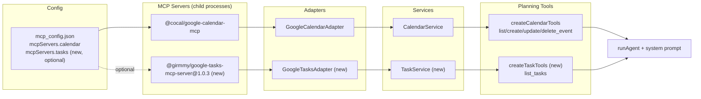

# 実装計画: Google Tasks 連携によるタスク取得機能の追加

## 元Issue
- #3: [Feature] Google Tasks API を利用して AI エージェントがタスクを取得できるようにする
- https://github.com/ryuma-1/satellite/issues/3

## 概要
既存の Google Calendar 連携（adapter → service → planning tools → agent）と同じ層構成を Google Tasks にも追加し，AI エージェントが `list_tasks` ツールでユーザーのタスクを取得できるようにする．今回のスコープは取得のみで，作成・更新・削除は対象外．

## 要件
- AI エージェントが Google Tasks API 経由でタスク一覧を取得できる（`list_tasks` ツールとして公開）
- 既存のカレンダー連携と同様の層構成（Adapter / Service / Planning Tools）を踏襲する
- MCP サーバーとして `@girmmy/google-tasks-mcp-server`（`1.0.3` にピン留め，`bunx` 起動）を利用する．calendar と同様 package.json には追加しない
- 読み取る対象タスクリストは `mcp_config.json` の tasks サーバー設定で指定する（calendar の `calendarIds` に相当するフィールドを新設）
- `mcpServers.tasks` が設定ファイルに存在しない場合，CLI はカレンダーのみで動作を継続する（tasks は完全にオプショナル）
- マルチアカウント対応は今回のスコープ外（tasks には `accounts` の概念を持ち込まない）
- 作成・更新・削除ツールは提供しない

## 実装方針
ユーザーのドラフト（`@girmmy/google-tasks-mcp-server@1.0.3` の採用，タスクリストIDを設定ファイルで指定，tasks サーバーはオプショナル）をそのまま採用する．調査の結果，この方針自体に矛盾や実現不能な点は見当たらなかった．ただし以下は実装上の解釈・決定が必要だったため，ここで明示し，リスク欄でも触れる．

- **`taskListIds` フィールドの意味論**: `calendarIds`（"primary" は常に暗黙で問い合わせるため，そこに含めることを禁止し，それ以外の追加カレンダーだけを列挙する）と全く同じ意味論を採用する．すなわち `mcpServers.tasks.taskListIds` は「`@default` に加えて読む，追加のタスクリストID」の配列とし，配列に `@default` を含めることは禁止する．省略時（`[]`）は `@default` のみを読む．これにより `parseCalendarIds` とほぼ同じバリデーションロジックを再利用でき，解決後の実効リストは常に `["@default", ...taskListIds]` となる．
- **`completed` フィルタの実装方法**: `@girmmy/google-tasks-mcp-server` の `show_completed` は「完了タスクを含めるか否か」のトグルであり，「完了タスクのみ」を取得する手段が無い．そのため adapter は常に `show_completed: true, show_hidden: false, show_deleted: false` で取得し，`ListTasksParams.completed` によるフィルタは取得後にクライアント側（adapter または service）で行う．
- **due date（期限）の扱い**: Google Tasks の `due` は常に `T00:00:00.000Z`（UTC）で日付のみを表す値．素朴に `new Date(due)` してから `.getDate()` 等でローカル日付を扱うと，UTC より西のタイムゾーンで前日にずれるバグになる．カレンダーの全日イベント（`date` フィールド）と同じ「YYYY-MM-DD 部分だけを取り出してローカル深夜として構築する」方式を tasks の mapper でも踏襲する．
- **tasks サーバーの「オプショナル」の範囲**: 「オプショナル」は「`mcp_config.json` に `tasks` エントリが無い場合はカレンダーのみで動く」という設定不在時の話に限定して解釈する．`tasks` エントリが存在するのに接続や認証に失敗した場合は，calendar 同様にフェイルファスト（CLI 全体がエラー終了）とし，黙って calendar-only にフォールバックはしない．
- **アカウント非対応の実装**: `GoogleTasksAdapter` は calendar のような `accounts` オプションを持たず，単一アカウント・複数タスクリストのみをサポートする．`mcp_config.json` の generic `McpServerConfig.accounts` フィールド自体は既存同様どのサーバー種別にも存在するが，tasks サーバーでは無視され，使用しない．

## 構成の変化

## タスク一覧

### Config層（`src/config/mcp_config.ts`）
- [x] `McpServerConfig` に `taskListIds: string[]` フィールドを追加する
- [x] `parseCalendarIds` と同等のバリデーション（非空文字列・重複禁止・既定値である `"@default"` を含むことを禁止）を `taskListIds` にも適用する（既存関数を汎用化して共有するか，同形の別関数を用意する）
- [x] `src/config/mcp_config.test.ts` に `taskListIds` のデフォルト値・バリデーションのテストを追加する

### Infrastructure層（新規: `src/adapters/google-tasks/`）
- [x] `mapper.ts`: Google Tasks の生タスク（`id`, `title`, `status`, `due`, `notes`, `completed`, ...）を共有モデル `Task` に変換する `toTask()` を実装する．`due` は日付部分のみを取り出しローカル深夜の `Date` として構築する
- [x] `mapper.ts`: フィルタ用の `dueBefore`/`dueAfter` を `due_min`/`due_max`（RFC 3339 UTC タイムスタンプ）に変換するヘルパーを実装する
- [x] `adapter.ts`: `GoogleTasksAdapter implements TaskService` を実装する
  - `google_tasks_list_tasks` を `tasklist_id` ごと（`@default` + 設定された `taskListIds`）に呼び出し，`page_token`/`has_more` によるページネーションを完走してから結合する（calendar の `Promise.allSettled` + 失敗集約パターンを踏襲）
  - 呼び出しは常に `show_completed: true, show_deleted: false, show_hidden: false, limit: 100` を指定し，`completed` フィルタは取得後にクライアント側で適用する
  - 複数タスクリストが設定されている場合のみ，結果に `taskListId` をタグ付けする（`calendarId` タグ付けと同じ方針）
- [x] `adapter.test.ts` / `mapper.test.ts` / `fixtures/list-tasks.json` を，calendar の対応するテスト・フィクスチャ（`FakeCaller` 等）に倣って作成する

### Application層（新規: `src/services/tasks.ts`）
- [x] `Task`（`id`, `title`, `due?`, `completed`, `notes?`, `taskListId?`）と `ListTasksParams`（`dueBefore?`, `dueAfter?`, `completed?`）を定義する
- [x] `TaskService` インターフェースに `listTasks(params?): Promise<Task[]>` のみを定義する（design_doc の `createTask`/`updateTask`/`deleteTask` は今回のスコープ外として含めない）

### Planning層（新規: `src/planning/task_tools.ts`）
- [x] `TaskView`（`due` は `formatLocalDate` で `YYYY-MM-DD` 文字列化）と `toTaskView()` を実装する
- [x] `createTaskTools(service: TaskService, taskListIds: string[]): ToolSet` を実装し，`list_tasks` ツール（入力: `dueBefore?`, `dueAfter?`, `completed?`）のみを公開する
- [x] `resolveTaskListIds` 相当のヘルパー（`@default` + 設定された `taskListIds` の重複排除済み配列を返す）を実装し，`taskListId` を出力にタグ付けするか判定する
- [x] `src/planning/task_tools.test.ts` を，`calendar_tools.test.ts` の `FakeCalendar` パターンに倣って作成する

### Planning層（`src/planning/system_prompt.ts`）
- [x] `buildSystemPrompt` に `taskListIds: string[] = []` パラメータを追加する．空配列（tasks 未設定）なら関連する案内文を出さず，非空ならタスクツールの利用指示を追加し，複数タスクリストが設定されている場合はそれらを列挙する（calendar の `calendarIds` 表示ロジックに準拠）
- [x] `src/planning/system_prompt.test.ts` に上記の追加・省略パターンのテストを追加する

### Wiring層（`src/index.ts`）
- [x] `config.mcpServers.tasks` の有無を判定し，存在する場合のみ `McpConnection.connect()` して `GoogleTasksAdapter` と `createTaskTools` を構築する
- [x] `calendar` と `tasks` の両方の接続を，どちらが未接続でも安全に close できるように管理する（tasks 接続失敗時は calendar 接続も含めて例外を伝播させ，フェイルファストにする）
- [x] `createCalendarTools` の結果と `createTaskTools` の結果をマージして `runAgent` の `tools` に渡す
- [x] `buildSystemPrompt` 呼び出しに，tasks が設定されている場合の `taskListIds` を渡す

### 設定ファイル例
- [x] `mcp_config.json.example` に `tasks` サーバーのエントリを追加する（`command: "bunx"`, `args: ["@girmmy/google-tasks-mcp-server@1.0.3"]`, `env: { GOOGLE_TASKS_CLIENT_SECRET: "${GOOGLE_OAUTH_CREDENTIALS}", GOOGLE_TASKS_TOKEN_PATH: "~/.config/satellite/google-tasks-tokens.json" }`, `taskListIds` フィールドの使用例）
- [x] `.env.example` は既存の `GOOGLE_OAUTH_CREDENTIALS` を再利用できるため，変更が不要かどうか確認する（新規env変数を追加しない前提）

## リスク・確認事項
- **`taskListIds` の意味論**: 「`calendarIds` に倣う」を「`@default` 以外の追加分のみを列挙し，`@default` 自体を含めることは禁止する」という意味で解釈した．ユーザーの例示（省略時 `["@default"]`）とは，実効リスト（解決後）としては一致するが，フィールド自体の意味（「追加分のみ」か「完全なリスト」か）は解釈の余地があるため，実装前に確認したい．
- **tasks 接続失敗時の扱い**: 「オプショナル」を「設定不在時のみ」と解釈し，設定はあるが接続・認証に失敗した場合はフェイルファストとした．ユーザーが「接続に失敗してもカレンダーのみで動作継続してほしい」という意図であれば，`index.ts` 側でエラーを握りつぶして warning ログに留める設計に変更が必要になる．
- **due date の UTC 深夜変換**: `@girmmy/google-tasks-mcp-server` の `due` フィールドが常に `T00:00:00.000Z` である前提はパッケージの公開コードから確認した事実だが，将来のバージョンアップでフォーマットが変わるとローカル日付がずれる形で壊れうる．mapper のテストで日付境界（UTC 深夜が西半球ローカルでは前日になり得るケース）を明示的にカバーしておく必要がある．
- **`completed` フィルタのクライアント側実装**: 大量のタスクがある場合，`completed: true` 指定時でも一旦全件（`show_completed: true`）を取得してからフィルタするため，MCP サーバー呼び出し回数・ページネーション回数が増える可能性がある．今回のスコープでは許容範囲と判断したが，パフォーマンス上の懸念があれば別解（例: 完了/未完了で2回に分けて呼び分ける）を検討する余地がある．
- **`@girmmy/google-tasks-mcp-server` の一度きりの OAuth 認証手順**（`bunx -p @girmmy/google-tasks-mcp-server@1.0.3 google-tasks-mcp-auth`）はコード変更ではなく手動セットアップ手順であり，本計画のタスク一覧には含めていない．ユーザー自身が別途実行する必要がある．

## 検証
- `bun test`（新規の mapper / adapter / task_tools / system_prompt / mcp_config テストと既存テストがすべて通ること）
- `bunx tsc --noEmit` で型エラーがないこと
- 手動確認（認証後）: `mcp_config.json` に tasks を追加し `bun run src/index.ts 今週期限のタスクは？` で `list_tasks` が呼ばれること．tasks を外してもカレンダーのみで動くこと
