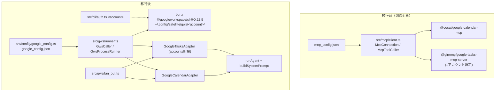

# 実装計画: Google Calendar/Tasks 連携を gws CLI に移行し，複数アカウント対応を統一する

> **planner が草案を検証した結果**（いずれも反映済み）
> 1. タスク連携を常時必須にするのは，#3 の「tasks は完全にオプショナル」という方針を廃止する変更である．草案で承認済みの方針なので，この計画に明示した．
> 2. `GoogleTasksAdapter` に `accounts` を新設するタスクが草案から漏れていたので，追加した．
> 3. `oauthClientFile` の JSON 構造は未検証なので，スパイクの確認項目に追加した．
> 4. gws のサブコマンド構文は推測なので，スパイクで確定させる．後続のタスクはスパイクの記録に依存する．

## 元Issue
- #5: [Feature] Google Calendar/Tasks 連携を gws CLI に移行し，複数アカウント対応を統一する
- https://github.com/ryuma-1/satellite/issues/5

## 概要
現状はカレンダーとタスクで別方式の MCP サーバーに依存している．
- カレンダー：`@cocal/google-calendar-mcp`（1 プロセスで，`account` 引数により複数アカウントに対応）
- タスク：`@girmmy/google-tasks-mcp-server`（1 プロセスで 1 アカウントのみ）

このため，タスクの複数アカウント対応をカレンダーと揃えられない．両方を `bunx @googleworkspace/cli@0.22.5`（gws）経由の実装に移行し，同じ runner・同じアカウント設定・同じループで動作するように統一する．ループは，アカウントごとに並列実行し，1 つでも失敗したら全体をエラーにするもの．

## 要件
- カレンダーとタスクが同じ仕組み（同じ runner・同じアカウント設定・同じアカウントごとのループ）で動作すること．
- 1 アカウントにつき 1 回の認証（`gws auth login -s calendar,tasks`）で，カレンダーとタスクの両方が使えること．
- 複数アカウント（normal/school 等）の予定とタスクをまとめて取得でき，それぞれにアカウント名が付くこと．
- 予定の一覧・作成・更新・削除とタスクの一覧取得は，現在と同じ振る舞いを保つこと．
  - 繰り返し予定の展開
  - `sendUpdates: none`
  - 終日予定の扱い
  - 期限での絞り込み，完了状態での絞り込み
  - ページ送り
- どれか 1 つでも取得に失敗した場合は，一部の結果だけを返さずにエラーにすること（既存方針の維持）．
- スコープ外：タスクの作成・更新・削除，README の更新（別途承認が必要），`showHidden` の挙動変更（別 issue 候補）．

## 実装方針
フェーズは 1 つだが，後続のほぼすべての実装が，実際に gws を動かして得られる事実に依存する（サブコマンド構文，レスポンス形状，エラー形式，ページング，認証の挙動）．そのため **T1 のスパイクを最初に単独で完了させる**．記録（`docs/spikes/gws-cli-0.22.5.md`）とサニタイズ済み fixture が揃ってから，次の順で進める．

config → runner → fan_out → adapter → services/planning → CLI → 削除 → ドキュメント

主な設計判断:
- **名前付きアカウントを最低 1 つ必須にし，名前なしの単一アカウントモードは廃止する**．設定ディレクトリはアカウント名から決まる（`<configDir()>/gws/<account>/`）．
- **予定・タスクには常に `account` を付ける**．`calendarId`/`taskListId` は，追加のカレンダー・リストを持つアカウントがある場合だけ付ける．
- **タスク連携は常に有効にする**（「tasks 未設定なら calendar だけで動く」という分岐は廃止）．`google_config.json` が無ければ，これまでどおりすぐにエラーで止める．
- 設定ファイルを `~/.config/satellite/google_config.json`（`oauthClientFile`，任意の `gwsCommand`，`accounts`）に一本化し，`mcp_config.json` は廃止する．
- ページ送りは `--page-all --page-limit 50`（NDJSON）を使う．上限に達しても `nextPageToken` が残っていれば，黙って切り捨てずにエラーにする．
- 繰り返し予定は `singleEvents: true, orderBy: "startTime"` で個別に展開する．
- `GoogleTasksAdapter` にも，`GoogleCalendarAdapter` と同じ形の `accounts` オプションを新設する．
- gws のサブコマンド構文，レスポンス形状，エラー形式，`oauthClientFile` の JSON 形式は，T1 スパイクの記録を正とする．
- 暗号化キーの保存先は `GOOGLE_WORKSPACE_CLI_KEYRING_BACKEND=file` とする（design_doc §1.4：OS キーチェーンは使わない）．

## 構成の変化

## タスク一覧

### スパイク（`docs/spikes/gws-cli-0.22.5.md`）※要ユーザー操作
- [x] （**要ユーザー操作**：実アカウントでの `gws auth login -s calendar,tasks` にブラウザでの OAuth 承認が必要）`bunx @googleworkspace/cli@0.22.5` を実際に動かして以下を確認し，`docs/spikes/gws-cli-0.22.5.md` に記録する
  - bunx がバイナリをどう取得するか，起動のレイテンシ，`--help` の内容（正確なサブコマンド構文，`--params` と `--json` の使い分け）
  - アカウントごとの認証：`GOOGLE_WORKSPACE_CLI_CONFIG_DIR` と `KEYRING_BACKEND=file` を指定すると，OS キーリングに何も登録されないこと
  - `oauthClientFile` の実際の JSON 構造（`installed`/`web` キー）
  - 予定一覧のレスポンス形状（school の共有カレンダーを含む．同じ共有カレンダーを normal 経由で取ると 404 になるか）
  - NDJSON の形式と，ページ上限に達したことの判定方法
  - タスク一覧のレスポンス形状と，「テストタスク」がどちらのアカウントにあるか
  - エラー時の JSON 形状と，終了コード（1 API/2 認証/3 検証/4 Discovery/5 内部）との対応
  - insert → patch → delete の挙動（delete の出力が空か，時刻指定 ↔ 終日の切り替えに `null` が必要か）
  - プロジェクトの `.env` が gws に読み込まれる（dotenvy）ことの影響
- [x] 生レスポンスから機密情報を除去した fixture を，calendar と tasks の fixtures ディレクトリに作成する

### Config 層（`src/config/google_config.ts`，`google_config.json.example`）※スパイク完了後
- [x] `google_config.ts` を新設する．`oauthClientFile`，`gwsCommand`，`accounts`（各アカウントに `calendarIds`/`taskListIds`）をパースする
  - `accounts` は 1 件以上を必須とする
  - 既存の `ACCOUNT_NAME`，`parseAdditionalIds`，重複チェック，`${VAR}` 展開を流用する
- [x] `loadOAuthClient(path)` を追加する
- [x] `accountConfigDir(account)`（パーミッション 0700）を追加する
- [x] `google_config.test.ts` を作成する
- [x] `google_config.json.example` を新設する

### Infrastructure 層 - gws runner（`src/gws/runner.ts`，`src/gws/fan_out.ts`）
- [x] `GwsCaller`（`call(account, req)` / `callAllPages(account, req)`）とその実装 `GwsProcessRunner` を作る
  - 起動は `Bun.spawn`，`stdin: "ignore"` とタイムアウトを設定する
  - 同じアカウントへの呼び出しは直列にする
- [x] 純粋関数 `buildGwsArgs` / `gwsEnv` / `parseGwsOutput` / `toGwsError` を切り出す
- [x] `toGwsError`：終了コードを `GwsError` に変換する．コード 2 のときは `bun run src/cli/auth.ts <account>` を案内する
- [x] `runner.test.ts`：偽の gws スクリプトを使って，正常系，各エラーへの変換，ページ上限に達したときのエラーを検証する
- [x] `fan_out.ts`：アカウント × カレンダー/タスクリストを並列実行し，1 つでも失敗したら全体をエラーにする共通ヘルパーを作る
- [x] `fan_out.test.ts` を作成する

### Infrastructure 層 - Adapter（`src/adapters/google-calendar/`）
- [x] `adapter.ts` を `GwsCaller` ベースに書き換える．`accounts` を必須にし，`account === undefined` の分岐を除去する
- [x] `sendUpdates: "none"` と `singleEvents: true, orderBy: "startTime"` を維持する
- [x] 時刻指定 ↔ 終日を patch で切り替えるとき，反対側のフィールドを明示的に `null` でクリアする
- [x] `mapper.ts`：`Mcp*` を `GoogleEvent`/`toRfc3339` などに改名し，gws のレスポンス形状に合わせる
- [x] `adapter.test.ts`，`mapper.test.ts`，fixture を更新する

### Infrastructure 層 - Adapter（`src/adapters/google-tasks/`）
- [x] `adapter.ts` に `accounts` オプション（アカウントごとの `taskListIds`）を新設し，fan_out 経由で取得する
- [x] tasks list を次の指定で呼ぶ
  - `showCompleted: true, showHidden: false, showDeleted: false`
  - `dueMin`/`dueMax` は既存の `toDueTimestamp`/`toDueMaxTimestamp` で作る
  - `completed` の絞り込みは取得後にクライアント側で行う
- [x] ページングを NDJSON に書き換え，@girmmy 固有だった再取得ロジックを削除する
- [x] `mapper.ts` を調整する（`due` の日付の扱いは維持）
- [x] `adapter.test.ts`，`mapper.test.ts`，fixture を更新する

### Application 層（`src/services/`）
- [x] `Task` に `account?: string` を追加する
- [x] `ListTasksParams` と `TaskService` のシグネチャに変更が必要かを確認する

### Planning 層（`src/planning/`）
- [x] `resolveCalendarIds(accounts, defaultCalendarId)` を単純化する
- [x] `resolveAccountTaskLists` を新設し，`createTaskTools(service, accountTaskLists)` に変更する
- [x] `TaskView.account` を追加する
- [x] `buildSystemPrompt` の引数をオプションオブジェクトにまとめ，タスクのアカウントとタスクリストを案内する
- [x] 関連するテストを更新する

### CLI 層（`src/index.ts`，`src/cli/`）
- [x] `src/index.ts` を書き換える（MCP 接続のクローズ処理は削除）
- [x] `src/cli/calendar_check.ts` を runner ベースに移行する
- [x] `src/cli/tasks_check.ts` を新設する
- [x] `src/cli/auth.ts <account>` を新設する（runtime と同じ `gwsEnv` で `gws auth login -s calendar,tasks` を実行）

### 削除・依存整理
- [x] `src/mcp/`，`mcp_config.ts` とそのテスト，`mcp_config.json.example` を削除する
- [x] `bun remove @modelcontextprotocol/sdk` を実行する（新しい依存は追加しない）
- [x] `git grep -n "modelcontextprotocol\|McpToolCaller\|mcp_config"` が 0 件であることを確認する（`docs/plans` は除く）

### ドキュメント（`design_doc.md`）
- [x] §1 の図と §1.4 を gws 前提に更新する
- [x] §4 を，複数アカウントを対象範囲に含める形に更新する
- [x] §5.3 を更新する
- [x] §7.1 と §8 を `google_config.json` と `src/gws/` に合わせて更新する
- [x] README.md は変更しない（必要な差分は提案として報告だけする）

## リスク・確認事項
- gws の構文，レスポンス形状，エラー形式，ページ上限の判定方法は，スパイクで確定する．これらは runner の中に閉じ込め，他の層に影響させない．
- `oauthClientFile` の JSON 構造は未検証の前提である．
- タスク連携を常時必須にすることは，#3 の方針を廃止する変更である（草案で承認済み）．
- `showHidden: false` の既存の挙動は維持する（別 issue の候補）．
- アカウント × カレンダー/リストの数だけ bunx プロセスが起動するので，レイテンシが増える可能性がある．`gwsCommand` で直接バイナリを指定できるようにして緩和する．
- file キーリングでは，暗号化キーがトークンと同じ場所に置かれる．ディレクトリを 0700 にする．
- `GoogleTasksAdapter` に accounts を新設することは，#3 の設計判断を覆す変更だが，この Issue の目的に必要である．

## 検証
- 自動テスト
  - `bun test`：runner，fan_out，config，両 adapter と mapper，tools，プロンプト
  - `bunx tsc --noEmit`
  - `git grep -n "modelcontextprotocol\|McpToolCaller\|mcp_config"` が 0 件（`docs/plans` は除く）
- 手動 E2E（要ユーザー操作）
  1. `bun run src/cli/auth.ts normal` と `bun run src/cli/auth.ts school` を実行し，`gws/{normal,school}/` がパーミッション 0700 で作られること
  2. `bun run src/cli/calendar_check.ts 14` で，両アカウントの予定と共有カレンダーの予定が時刻順に表示され，繰り返し予定が展開されていること
  3. `bun run src/cli/tasks_check.ts` で，両アカウントのタスクと「テストタスク」が表示されること
  4. `bun run src/index.ts 今週の予定とタスクを教えて` の回答に，両アカウントの予定と「テストタスク」が含まれること
  5. テスト予定を作成 → 終日予定に変更 → 削除し，招待メールが送られていないこと
  6. 1 つのアカウントのディレクトリを壊すと，認証の案内付きのエラーになること
