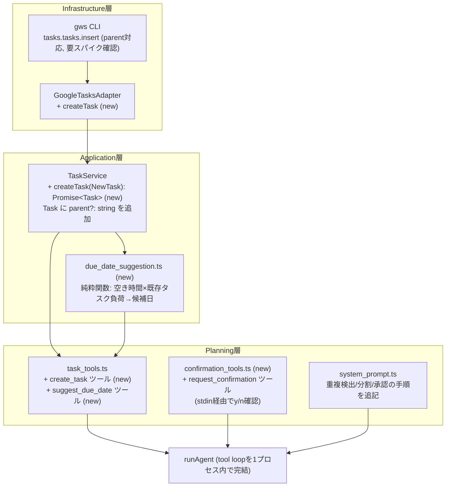

# 実装計画: 自然言語からのタスク作成（期日提案・重複検出・サブタスク分割・承認フロー付き）

## 元Issue
- #7: [Feature] 自然言語で指定したタスクを，既存のタスクと予定を考慮して作成できるようにする
- https://github.com/ryuma-1/satellite/issues/7

## 概要
現状 `TaskService`/`task_tools.ts` は `listTasks`（読み取り）のみで，タスクの作成手段が存在しない．本Issueでは，Google Calendar側の `createEvent` と対称的な `createTask` をAdapter/Service層に追加した上で，Planning層に「期日提案」「作成前の承認」という新しい振る舞いを組み込み，ユーザーが自然言語で「〇〇をやる」と伝えるだけでタスクが作成できるようにする．

## 要件（Issue本文の整理）
- 自然言語の依頼から，エージェントがGoogle Tasksにタスクを作成できること．
- 作成時に既存のタスク・予定を考慮すること．
  - 予定の空き具合・既存タスクの負荷から，無理のない期日を自動提案する．
  - 似たタスクが既にある場合は重複として検出する．
  - 大きなタスクはサブタスクに分割して作成する．
- 作成前にエージェントが作成内容（タイトル・期日・分割内容など）を提示し，ユーザーが承認してから登録する．
- 参考箇所（現状の事実）: `src/services/tasks.ts`（`listTasks`のみ），`src/planning/task_tools.ts`（`list_tasks`のみ），`src/planning/calendar_tools.ts`（CRUD一式が既にある）．

## 実装方針
CRUD拡張（タスク作成）と，判断ロジック（期日提案・重複検出・分割・承認）は性質が異なるため，3フェーズに分ける．フェーズ2以降は前フェーズの型・ツールに依存する．

1. **フェーズ1: `createTask` の追加**（calendarの `createEvent` と対称な低レベルCRUD拡張）
   - Infrastructure（gws）→ Application（`TaskService`）→ Planning（`create_task` ツール）まで一気通貫で追加する．サブタスクは Google Tasks の `parent` パラメータで表現する（要: gwsでの挙動確認スパイク）．
2. **フェーズ2: 期日提案ロジックの追加**
   - 既存の `list_events`/`list_tasks` 相当のデータから，空き時間と既存タスク負荷をもとに候補日を計算する純粋関数を実装し，`suggest_due_date` ツールとして公開する（design_docの「コード側で保証すべき計算はLLMに任せない」方針を踏襲；Timefold不使用の代替実装）．
3. **フェーズ3: 承認フローとシステムプロンプトの拡張**
   - 汎用的な「ユーザー確認」ツール（`request_confirmation`）を追加し，`create_task` を呼ぶ前に必ず経由させる．重複検出・サブタスク分割の判断はコード化せず，システムプロンプトの手順指示でLLMに行わせる．

## 構成の変化

## タスク一覧

### 事前調査（フェーズ1着手前に必須）
- [x] `gws schema tasks.tasks.insert --resolve-refs` 等で，`insert` の `parent` クエリパラメータ（サブタスク作成）と `due`/`notes` のリクエストボディ形状を確認し，`docs/spikes/gws-cli-0.22.5.md` に追記する（既存スパイクの追補という位置づけ）
- [x] 実アカウントに対し実際に `tasks.tasks.insert`（`parent`指定あり／なし）を試し，レスポンス形状・エラー挙動を確認する

### Infrastructure層（`src/adapters/google-tasks/`）
- [x] `mapper.ts`: `toTask()` が既存の `GoogleTask.parent` を `Task.parent` に反映するようにする（`GoogleTask`型には既に`parent`フィールドがあるが未使用）
- [x] `mapper.ts`: `NewTask` → gwsの `insert` ボディへの変換ヘルパーを追加する（`title`/`notes`/`due`（既存の `toDueTimestamp` を再利用）/`parent`）
- [x] `adapter.ts`: `GoogleTasksAdapter` に `createTask(task: NewTask): Promise<Task>` を実装する（`tasks.tasks.insert` を呼び，`account`/`taskListId` は calendarの `createEvent` と同様デフォルト解決する．`parent` はクエリパラメータとして渡す）
- [x] `adapter.test.ts`/`mapper.test.ts` に `createTask`（親タスク作成／`parent`指定でのサブタスク作成）のテストを追加する（`bun test`）

### Application層（`src/services/tasks.ts`）
- [x] `Task` に `parent?: string` を追加する
- [x] `NewTask` 型（`title`, `due?`, `notes?`, `account?`, `taskListId?`, `parent?`）を定義する
- [x] `TaskService` に `createTask(task: NewTask): Promise<Task>` を追加する（`listTasks` のみだった責務を拡張）

### Application層（新規: `src/planning/due_date_suggestion.ts`）
- [x] 既存の `CalendarEvent[]`/`Task[]` を入力に，「1日あたりの空き時間」と「既存タスクの期日集中度」から無理のない候補日を返す純粋関数 `suggestDueDate()` を実装する（外部依存なし・ロジックはコード側で保証：design_doc §3.2の方針を踏襲，Timefoldの代替）
  - 入力: 現在日時，検索対象期間（例: 既定14日），新規タスクの見積り所要時間（LLMが渡す，未指定時は既定値），稼働時間帯の既定値
  - 出力: 候補日と，その根拠（その日の空き時間，その日に既に期日設定されている既存タスク件数）
  - 閾値（稼働時間帯，1日あたりの最大タスク件数など）は定数として定義し，境界値のテストを書く
- [x] `due_date_suggestion.test.ts` を追加し，予定が詰まっている日をスキップするケース・既存タスクが多い日をスキップするケース・境界値を検証する（`bun test`）

### Planning層（`src/planning/task_tools.ts`）
- [x] `TaskView` に `parent?: string` を追加し，`toTaskView()` に反映する
- [x] `create_task` ツールを追加する（入力: `title`, `due?`, `notes?`, `parent?`（サブタスク化する場合，`list_tasks`/直前の`create_task`結果のidを指定）, `account?`, `taskListId?`；calendarの `create_event` と同様のデフォルト解決・スコープ表示パターンを踏襲）
- [x] `suggest_due_date` ツールを追加する（内部で `taskService.listTasks()`/`calendarService.listEvents()` を呼び，`due_date_suggestion.ts` の関数に渡す；入力は見積り所要時間など最小限）
- [x] `task_tools.test.ts` に `create_task`/`suggest_due_date` のテストを追加する（既存の `FakeCalendar`/`FakeTask` パターンに倣う）

### Planning層（新規: `src/planning/confirmation_tools.ts`）
- [x] 汎用の `request_confirmation` ツールを実装する（入力: `summary: string`（提案内容全文）；`execute` は `summary` を表示した上でBunの `prompt()`（同一プロセス内でstdinをブロッキング読み取り，新規依存なし）でy/n確認し，`{ approved: boolean }` を返す）
- [x] `confirmation_tools.test.ts` を追加する（`prompt` を差し替え可能にする，あるいは注入可能な確認関数として設計しテスト容易性を確保する）

### Planning層（`src/planning/system_prompt.ts`）
- [x] タスク作成に関する手順をシステムプロンプトに追記する
  - タスク作成依頼を受けたら，まず `list_tasks`（重複検出のため）・`list_events`/`suggest_due_date`（期日提案のため）を呼ぶこと
  - 既存タスクと類似度が高いと判断した場合は，重複の可能性をユーザーへの提示に含めること
  - タスクが大きいと判断した場合は，サブタスクに分割する案を組み立てること（分割はLLMの判断，コード化しない）
  - `create_task` を呼ぶ前に，必ず `request_confirmation` を呼び，タイトル・提案期日・分割内容を含む全文を提示すること．`approved: false` の場合は `create_task` を呼ばないこと
- [x] `system_prompt.test.ts` に追記内容のテストを追加する

### Wiring層（`src/index.ts`, `src/planning/agent.ts`）
- [x] `createTaskTools`/`createConfirmationTools` の結果を `runAgent` の `tools` にマージする
- [x] 承認込みの一連の流れ（コンテキスト取得→提案→確認→複数回の`create_task`）がデフォルトの `maxSteps`（現状10）に収まるか見積もり，不足するようなら `runAgent` 呼び出し時の `maxSteps` を引き上げる（要リスク確認）

## リスク・確認事項
- **`prompt()` によるstdinブロッキング確認**: Bunの `prompt()` は同一プロセス内で同期的にstdinを読むため，非TTY環境（パイプ実行やCI等）では待機・失敗する可能性がある．現状のCLIは対話的な単発コマンド利用を想定しているため許容範囲と考えるが，将来非対話実行が必要になった場合は別途対応が要る．
- **会話の状態を持たない現行アーキテクチャ**: `bun run src/index.ts <question>` は1回の呼び出しが1ターンで完結し，会話履歴は永続化されない．今回の承認フローは「同一プロセス内でツール呼び出しを一時停止してstdinから確認を取る」方式にすることで，会話永続化なしに実現する設計とした．これは既存の「Toolは単純なCRUD／副作用のみ」という設計思想からの逸脱（Tool内で対話的な確認を行う）でもあるため，設計方針として明示的な承認をお願いしたい．
- **`gws tasks.tasks.insert` の `parent` パラメータの挙動が未検証**: 事前調査タスクで確認できなければ，サブタスク作成の実装方式（`insert`時に直接指定 vs 作成後に`move`で親子付け）を見直す必要がある．
- **期日提案ヒューリスティックの閾値は仮決め**: 稼働時間帯・1日あたりの最大タスク件数などの定数は初期実装時の設計判断であり，実運用しながら調整が必要になる可能性が高い．
- **`maxSteps` 不足の可能性**: サブタスクを複数作成するケースでは，コンテキスト取得・提案・確認・複数回の`create_task`でツール呼び出し回数が既存の想定より増える．
- **スコープ外の明示**: タスクの更新・削除は本Issueの対象外とする（`createTask`のみ追加し，`updateTask`/`deleteTask`は追加しない）．
- **Timefold Solver は不採用**: JS/TS バインディングがなく JVM サイドカーが必要で，本Issueの規模（単一タスクの期日提案）に対して過剰なため．複数タスクの一括最適配置が必要になった時点で別Issueとして検討する．

## 主要な関連ファイル
- `src/services/tasks.ts`
- `src/planning/task_tools.ts`
- `src/planning/calendar_tools.ts`（対称実装の参考）
- `src/adapters/google-tasks/adapter.ts`
- `src/adapters/google-tasks/mapper.ts`
- `src/adapters/google-calendar/adapter.ts`（`createEvent`実装の参考）
- `src/planning/agent.ts`
- `src/planning/system_prompt.ts`
- `src/index.ts`
- `docs/spikes/gws-cli-0.22.5.md`
- `design_doc.md`
