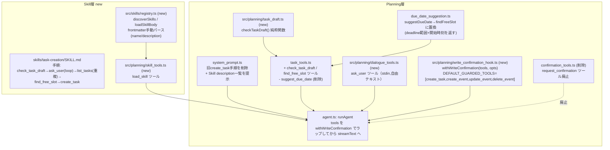
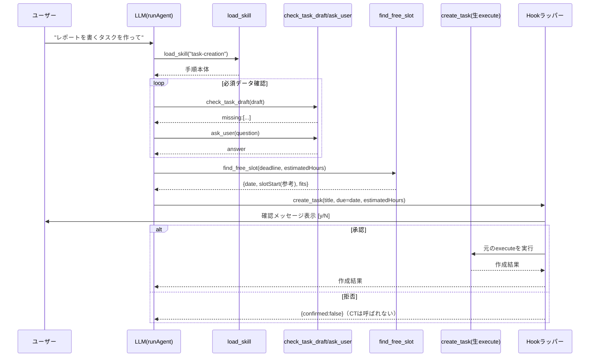

# 実装計画: Skill層の実装とタスク作成Skillへの移行，書き込み系ツールへのHookによる強制確認

## 元Issue
- #9: [Feature] タスク作成を Skill として実装し，書き込み系ツールの実行前に Hook で必ずユーザー確認を挟む
- https://github.com/ryuma-1/satellite/issues/9

## 概要
design_doc.md §2で設計されたSkill層（`SKILL.md`のdescription提示→本体の遅延読み込み）を実装し，これまでシステムプロンプトの指示だけに依存していたタスク作成手順を，最初のSkill「task-creation」として移す．同時に，`create_task`/`create_event`/`update_event`/`delete_event`という書き込み系ツールの`execute`実行を横断的に取り囲むHook機構を導入し，LLMがどの順でツールを呼んでも確認をスキップできない構造にする．これに伴い，現行の`request_confirmation`ツール（LLMが呼び忘れると確認が飛ぶ）は廃止する．

## 要件
- **Skill層**: `skills/<name>/SKILL.md`（YAMLフロントマターの`name`/`description` + 本体Markdown）を発見・読み込みできること．description一覧を毎回システムプロンプトに提示し，該当Skillの本体は`load_skill`のようなToolで遅延読み込みする（design_doc §2.2の`loadSkill(name)`パターン）．
- **タスク作成Skill**: 自然言語の手順（Skill本体）とツールの関数を組み合わせ，毎回同じ流れでタスクを作成できること．
- **必須データが揃うまで質問**: タイトル・見積り時間・締切（deadline）の3つが揃うまで，`check_task_draft`のような関数で判定し，`ask_user`のような対話ツールで不足分を質問し続ける．
- **空き時間から期日を決める**: 現在に近い日程のうち，締切までの範囲・作業時間（schedule_config.json）の中だけを対象に，予定と既存タスクの見積り時間を差し引いて空いている時間の開始時刻を関数で取得する（`find_free_slot`）．見つかった枠の**日付**を期日として保存し，開始時刻は確認画面での参考表示にのみ使い保存しない．
- **書き込み前の強制確認**: `create_task`/`create_event`/`update_event`/`delete_event`の直前に，Hookで内容を提示してユーザーの確認を取る．拒否時は実行しない．LLMの呼び方に関係なく確認をスキップできない．対象ツールは後から追加できる作りにする．
- **`request_confirmation`廃止**: 重複検出・サブタスク分割の判断はSkillの手順（自然言語）側に残すが，確認自体はHookに一本化する．
- **対話はstdin方式を維持**: `ask_user`もHookの確認も，現行の`request_confirmation`と同じ「同一プロセス内でstdinを同期読み取り」方式を踏襲する．
- 新規依存パッケージの追加は不可（フロントマター解析等は既存の`ai`/`zod`/Bun標準のみで実装する）．

## 実装方針
Hook機構（既存のCRUDツールに影響しない横断的関心事）と，Skill層＋タスク作成Skillの中身（新しい振る舞い）は独立して検証できるため，3フェーズに分ける．フェーズ2・3はフェーズ1のHookの上に乗る．

1. **フェーズ1: Hook機構の導入と`request_confirmation`の廃止**
   `runAgent`（Planning/Orchestration層の中核ループ）が，指定した書き込み系ツール名の`execute`を必ずラップしてから`streamText`に渡すようにする．どのツール名を対象にするかは呼び出し側から渡せる（既定値を定数で持つ）ので拡張は容易．`confirmation_tools.ts`は削除し，y/n確認のstdin実装はHook側に移す．
2. **フェーズ2: Skill層の実装**
   `skills/`配下の`SKILL.md`を発見・読み込みするレジストリと`load_skill`ツールを実装し，system_prompt.tsにdescription一覧の提示ロジックを追加する．
3. **フェーズ3: タスク作成Skillへの移行**
   `check_task_draft`（必須データ判定）・`ask_user`（対話）・`find_free_slot`（締切までの空き時間探索，開始時刻付き）を実装し，`skills/task-creation/SKILL.md`に手順を書く．system_prompt.tsから旧create_task手順（重複確認・期日提案・分割・request_confirmation）を削除し，`due_date_suggestion.ts`の`suggestDueDate`/`suggest_due_date`ツールは`find_free_slot`に置き換える（唯一の利用元だったタスク作成手順がSkillに移るため）．最後にindex.tsの結線を更新する．

## 構成の変化

## タスク一覧

### フェーズ1: Hook機構（`src/planning/write_confirmation_hook.ts`）
- [x] `write_confirmation_hook.ts`を新規作成し，`ConfirmFn`（`confirmation_tools.ts`から移設）・`promptConfirm`（y/n, stdin）・`DEFAULT_GUARDED_TOOLS = ["create_task", "create_event", "update_event", "delete_event"]`・`withWriteConfirmation(tools: ToolSet, options?: { toolNames?: readonly string[]; confirm?: ConfirmFn; summarize?: (toolName: string, input: unknown) => string }): ToolSet`を実装する．対象ツール名にマッチするものだけ`execute`を，`confirm(summarize(...))`→拒否なら元の`execute`を呼ばず`{ confirmed: false }`相当を返す，承認なら元の`execute`を呼んでその結果を返す，という形にラップする．対象外のツールはそのまま透過させる．
- [x] 既定の`summarize`（tool名+`JSON.stringify(input)`のフォールバック）と，`create_task`/`create_event`/`update_event`/`delete_event`向けの読みやすいテンプレートを実装する
- [x] `write_confirmation_hook.test.ts`を追加し，承認/拒否時の分岐（元executeが呼ばれるか否か・返り値），対象外ツールの透過，拡張性（カスタム`toolNames`で任意のツール名を追加できること）を検証する（`bun test`）
- [x] `agent.ts`の`RunAgentOptions`にHook関連オプション（既定値あり）を追加し，`runAgent`内部で`streamText`に渡す前に`options.tools`を`withWriteConfirmation`でラップする（呼び出し側が明示的にラップし忘れても書き込み確認が必ず効くようにする，本Issueの「LLMがどう呼んでもスキップできない」を構造的に保証する箇所）
- [x] `agent.test.ts`に，ガード対象ツール（例: `create_task`という名のフェイクツール）が承認/拒否でどう振る舞うかの結合テストを追加する（`bun test`）
- [x] `confirmation_tools.ts`・`confirmation_tools.test.ts`を削除する（依存: 上記Hookが同等の確認機能を提供した後）
- [x] `system_prompt.ts`の`request_confirmation`に関する手順記述を削除する（依存: 上記）

### フェーズ2: Skill層の基盤（`src/skills/`, `skills/`）
- [x] `src/skills/registry.ts`を新規作成し，`SkillMeta { name: string; description: string }`・`discoverSkills(dir?: string): Promise<SkillMeta[]>`（`skills/*/SKILL.md`を走査し，先頭`---`ブロックから`name:`/`description:`を手動パース，新規依存なし）・`loadSkillBody(name: string, dir?: string): Promise<string>`（フロントマターを除いた本体を返す，未知の`name`はエラー）を実装する．既定の`dir`は`import.meta.dir`基準でリポジトリルートの`skills/`を指す（`src/config/paths.ts`のconfigDir同様，テストでは明示的な`dir`を渡す）
- [x] `registry.test.ts`を追加し，フロントマター解析（正常系・`name`/`description`欠落時のエラー），`loadSkillBody`の本体抽出，未知skill名のエラーを検証する（`bun test`）
- [x] `src/planning/skill_tools.ts`を新規作成し，`createSkillTools(skills: SkillMeta[], loadBody: (name: string) => Promise<string>): ToolSet`で`load_skill`ツール（`inputSchema: z.object({ name: z.enum([...]) })`）を実装する
- [x] `skill_tools.test.ts`を追加する（`bun test`）
- [x] `system_prompt.ts`の`BuildSystemPromptOptions`に`skills?: SkillMeta[]`を追加し，`name: description`の一覧と「該当するSkillがあれば`load_skill`で読み込んでからその手順に従うこと」という指示を出力するようにする
- [x] `system_prompt.test.ts`にSkill一覧が出力に含まれることのテストを追加する（`bun test`）

### フェーズ3: タスク作成Skill本体と支援ツール
- [x] `due_date_suggestion.ts`の`suggestDueDate`/`computeSearchRange`を`findFreeSlot`に置き換える（唯一の利用元がSkillの`find_free_slot`ツールになるため）．入力に`deadline: Date`を追加し（探索範囲を「締切まで」の作業日に限定），出力に`slotStart: Date`（その日の空き区間の開始時刻）を追加する．算出方法: 各候補日について，カレンダー予定で busy な区間を除いた作業時間内の空き区間を求め，その日に既に期日設定されている既存タスクの見積り時間合計をその日の最前部から予約済みとして消費し，残った空き区間のうち見積り時間以上の長さを持つ最初の区間の開始時刻を`slotStart`とする．締切まで見つからない場合は`fits: false`で最終候補日を返す（既存のフォールバック方針を踏襲）
- [x] `due_date_suggestion.test.ts`を`findFreeSlot`向けに更新する（締切境界・空き区間の開始時刻・既存タスク予約による開始時刻の後ろ倒し・fits:falseフォールバックのテストを追加）（`bun test`）
- [x] `src/planning/task_draft.ts`を新規作成し，`TaskDraftInput { title?: string; estimatedHours?: number; deadline?: string }`・`checkTaskDraft(draft): { complete: boolean; missing: Array<"title"|"estimatedHours"|"deadline"> }`（空文字や0以下の値は未入力扱い）を実装する
- [x] `task_draft.test.ts`を追加する（`bun test`）
- [x] `src/planning/dialogue_tools.ts`を新規作成し，`AskUserFn`・`promptText`（stdin, 自由テキスト読み取り，EOFは`undefined`）・`createDialogueTools(ask?: AskUserFn): ToolSet`で`ask_user`ツールを実装する（`confirmation_tools.ts`の`ConfirmFn`/`promptConfirm`パターンを踏襲し，注入可能にしてテスト容易性を確保する）
- [x] `dialogue_tools.test.ts`を追加する（`bun test`）
- [x] `task_tools.ts`に`check_task_draft`・`find_free_slot`ツールを追加し，`suggest_due_date`ツールを削除する（`find_free_slot`の`execute`は`deadline`をパースして`calendarService.listEvents`/`service.listTasks`を`deadline`までの範囲で取得し，`findFreeSlot`に渡す）
- [x] `task_tools.test.ts`を更新する（`suggest_due_date`関連テストの削除・`check_task_draft`/`find_free_slot`のテスト追加）（`bun test`）
- [x] `skills/task-creation/SKILL.md`を新規作成する．フロントマター（`name: task-creation`, `description: タスク作成を依頼されたときに使用する`）と，本体に以下の手順を書く: ①依頼を受ける ②`check_task_draft`で必須データ（タイトル・見積り時間・締切）を確認 ③不足があれば`ask_user`で質問し②③を繰り返す ④`list_tasks`で類似の既存タスクがないか確認し重複の可能性があれば提示 ⑤タスクが大きい場合はサブタスク分割案を組み立て各サブタスクについて⑥以降を繰り返す ⑥`find_free_slot`（`deadline`指定）で空き時間を取得しその日付を期日とする（開始時刻は参考表示のみ） ⑦`create_task`を呼ぶ（実行前の確認はHookが必ず行うので手順内で明示の確認呼び出しは不要．拒否された場合はユーザーにその旨を伝えて終了する）
- [x] `system_prompt.ts`から旧create_task手順（重複確認・estimatedHours見積り・`suggest_due_date`・分割・`request_confirmation`の番号付き手順）を削除する（依存: 上記Skill本体が同等の内容を持つこと）
- [x] `system_prompt.test.ts`から削除した手順に関するテストを除去し，Skill一覧提示のテストのみ残す（`bun test`）

### Wiring層（`src/index.ts`）
- [x] `discoverSkills`でSkillメタ情報を読み込み，`createSkillTools`・`createDialogueTools`をツールセットに追加し，`createConfirmationTools`の呼び出しを削除する
- [x] `buildSystemPrompt`呼び出しに`skills`オプションを渡す
- [x] Skill手順（`check_task_draft`↔`ask_user`の往復・`find_free_slot`・確認込みの`create_task`）が増えたステップ数を見積もり，`MAX_AGENT_STEPS`（現状20）が十分か確認し，不足する場合は引き上げる

### 全体確認
- [x] `bun test`を実行し，削除・変更したファイル（`confirmation_tools.*`削除，`due_date_suggestion.*`/`task_tools.*`/`system_prompt.*`更新）を含め全テストが通ることを確認する

## リスク・確認事項
- **Hookをどこに埋め込むか（設計判断）**: 本計画では`runAgent`（agent.ts）自身が書き込みツールをラップする構造を採る．これは「LLMがどう呼んでもスキップできない」という要件を，個々の呼び出し元（index.ts）の結線の慎重さに依存せず構造的に保証するための選択．一方で，agent.tsは元々「ToolSetを渡されて実行するだけの汎用ループ」だったため，どのツール名が書き込み系かという知識を一部持つことになる．既定値を定数として外部モジュールに置き，オプションで上書き可能にすることでこの結合を緩めるが，設計方針としてこれで良いか確認したい．
- **`suggest_due_date`→`find_free_slot`への置換は既存インターフェースの破壊的変更**: `suggestDueDate`/`computeSearchRange`（および対応するツール）は他の利用元がない前提で削除・置換するが，Issue #7のPR内容以降に外部からの依存が増えていないか確認が必要．
- **SKILL.mdのフロントマター解析を手動実装する**: `gray-matter`等のYAML/フロントマター専用ライブラリは導入せず，`name`/`description`の2フィールドのみを対象にした簡易パーサを自前実装する．将来Skillが複雑なメタデータを持つようになった場合は再検討が必要．
- **`ask_user`と確認Hookの二重stdinブロッキング**: タスク作成Skillの対話（`ask_user`の複数往復）とHookの確認（y/n）が同一プロセス内で連続してstdinを同期読みするため，非対話環境（パイプ実行等）では従来の`request_confirmation`と同様に待機・失敗し得る．既存の設計上の許容範囲を踏襲する．
- **`find_free_slot`の「既存タスク見積り時間を予約してから空き区間を探す」というアルゴリズムの妥当性**: 開始時刻はあくまで参考表示であり保存されないため，実装上の近似（タスクを1日の最前部にまとめて予約したと仮定する）で十分かは実装時に要確認．
- **`MAX_AGENT_STEPS`の再見積もり**: `load_skill`・`check_task_draft`⇄`ask_user`の往復・`find_free_slot`・`list_tasks`（重複確認）・確認込みの`create_task`が加わることで，Issue #7時点の見積り（20）を超える可能性がある．
